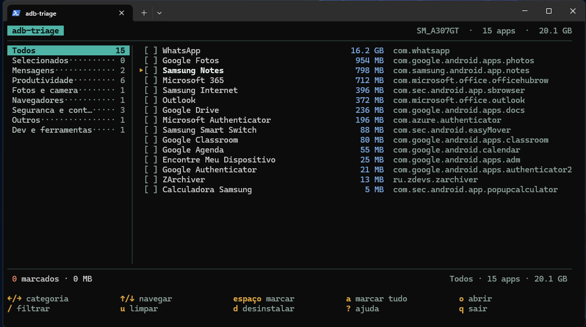

<h1 align="center">ADB Triage</h1>

<p align="center">
  
</p>

A terminal UI for reviewing and uninstalling Android apps over ADB.

Instead of scrolling through dozens of package names like
`com.instagram.barcelona`, **adb-triage** shows each app's real name,
category, and storage usage, making it easy to find and remove what you
actually want.

## Features

- Browse installed apps by category
- View app labels instead of raw package names
- See how much space each app occupies
- Batch select and uninstall applications
- Works offline using an embedded app database
- Local cache for resolved app labels
- Optional Claude integration for unknown packages

## Installation

Requirements:

- Go 1.24+
- `adb` available in your `PATH`

```sh
git clone <repo>
cd adb-triage
make build
```

### Windows

```powershell
winget install Google.PlatformTools
go build .
```

## Usage

Enable USB debugging, connect your device, then run:

```sh
./adb-triage
```

### Flags

| Flag | Description |
|------|-------------|
| `--llm` | Enable Claude lookups (requires `ANTHROPIC_API_KEY`). |
| `--all` | Include apps without launcher icons. |
| `--dump` | Print the app list as plain text and exit. |
| `--json` | Print the app list as JSON and exit. |

Example:

```sh
./adb-triage --json > apps.json
```

## Keyboard Shortcuts

| Key | Action |
|-----|--------|
| `←` `→` `h` `l` `Tab` | Change category |
| `↑` `↓` `j` `k` | Navigate |
| `PgUp` `PgDn` `g` `G` | Jump through the list |
| `Space` | Select or deselect an app |
| `a` | Toggle selection for the current category |
| `u` | Clear selection |
| `/` | Filter by app name or package |
| `Esc` | Clear filter |
| `d` | Review and uninstall selected apps |
| `?` | Show help |
| `q` | Quit |

Selections are global, so you can mark apps across multiple categories before uninstalling.

## App Labels

App names are resolved in the following order:

1. Embedded `seed.json`
2. Local cache
3. Claude (optional)

If none of the above can identify an app, a label is generated from its package
name and displayed in *italic* to indicate it is only an inferred name.

To enable Claude:

```sh
export ANTHROPIC_API_KEY=sk-ant-...
```

The application works normally without an API key.

## Contributing

If an app appears with an inferred name, consider adding it to
`internal/classify/seed.json` and opening a pull request.

Example:

```json
"com.example.app": {
  "label": "Example App",
  "category": "Shopping"
}
```

Rebuild after editing:

```sh
make build
```

Optionally, keep the database formatted consistently:

```sh
make fmt-seed
```

## Notes

- Uninstalling an app removes its local data.
- Storage sizes come from `dumpsys diskstats` and may not include media stored under `/sdcard/Android/media`.
- Some system applications cannot be removed via `pm uninstall --user 0`.

## Project Structure

```text
main.go
internal/
├── adb/
├── classify/
│   └── seed.json
└── ui/
cmd/
└── seedfmt/
```

## License

MIT
