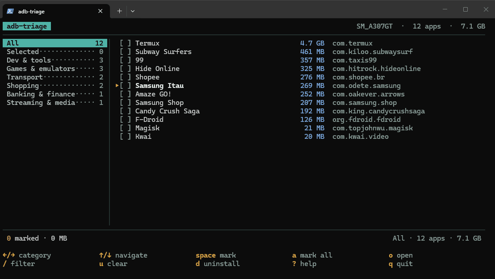

<h1 align="center">ADB Triage</h1>

<p align="center">
  
</p>

<p align="center">
  <a href="https://github.com/Lucasbc47/adb-triage/actions/workflows/ci.yml"></a>
  <a href="./LICENSE"></a>
  
  
</p>

<p align="center">
  <a href="./README.md">English</a>
  ·
  <b>Português (BR)</b>
</p>

Uma TUI pra revisar e desinstalar apps Android via ADB.

Em vez de rolar dezenas de nomes de pacote tipo `com.instagram.barcelona`,
o **adb-triage** mostra o nome real de cada app, a categoria e quanto de
espaço ele ocupa, o que torna fácil achar e remover o que você realmente quer.

```text
com.instagram.barcelona     ->  Threads      Social              412 MB
com.nianticlabs.pokemongo   ->  Pokemon GO   Games & emulators   1.8 GB
br.gov.caixa.tem            ->  Caixa Tem    Government & ID      96 MB
```

> A interface do programa é em inglês. Esta tradução cobre a documentação;
> os nomes de categoria e as mensagens que aparecem no terminal continuam
> em inglês, e estão citados aqui exatamente como o programa os exibe.

## Por quê

`adb shell pm list packages -3` te devolve uma parede de strings em DNS reverso,
sem tamanho, sem nome e sem jeito de agir em cima. O adb-triage transforma esses
mesmos dados numa lista navegável, ordenável e selecionável, e depois executa as
desinstalações de uma vez só.

## Recursos

- Navega pelos apps instalados agrupados por categoria, ordenados por tamanho
- Mostra o nome de exibição em vez do nome do pacote
- Espaço ocupado por app, os maiores primeiro
- Seleção em lote entre categorias, com uma única tela de confirmação
- Abre o app no aparelho pra você lembrar o que é antes de remover
- Totalmente offline: sem rede, sem API key, sem nada gravado em disco
- Os nomes vêm de uma base embutida de ~160 pacotes curados
- Saída `--dump` e `--json` pra scripts e comparações

## Começando rápido

```sh
adb devices          # confirme que o aparelho aparece como "device"
make build
./adb-triage
```

Move com `↑`/`↓`, troca de categoria com `←`/`→`, marca com `Espaço`,
desinstala com `d`, sai com `q`.

## Instalação

Requisitos:

- Go 1.24+
- `adb` no seu `PATH` (Android Platform Tools)
- Depuração USB ativada, com o aparelho autorizado

### Instalar

```sh
go install github.com/Lucasbc47/adb-triage@latest
```

### A partir do código

```sh
git clone https://github.com/Lucasbc47/adb-triage
cd adb-triage
make build
./adb-triage
```

### Windows

```powershell
winget install Google.PlatformTools
go build .
.\adb-triage.exe
```

### Instalando o adb

| Plataforma | Comando |
|------------|---------|
| Windows | `winget install Google.PlatformTools` |
| macOS | `brew install --cask android-platform-tools` |
| Debian/Ubuntu | `sudo apt install android-tools-adb` |
| Arch | `sudo pacman -S android-tools` |

## Uso

Ative a depuração USB, conecte o aparelho, aceite o aviso de autorização que
aparece na tela do celular e rode:

```sh
./adb-triage
```

Por padrão só aparecem os apps que têm ícone na gaveta, porque são os que você
reconhece e provavelmente quer remover. Use `--all` pra incluir serviços de
fundo e pacotes sem interface.

### Flags

| Flag | Descrição |
|------|-----------|
| `--all` | Inclui apps sem ícone na gaveta (serviços de fundo). |
| `--dump` | Imprime a lista em texto puro e sai, sem abrir a TUI. |
| `--json` | Imprime a lista em JSON e sai, sem abrir a TUI. |

Progresso e avisos vão pro stderr, então redirecionar o stdout continua limpo:

```sh
./adb-triage --json > apps.json
```

## Atalhos de teclado

### Navegação

| Tecla | Ação |
|-------|------|
| `←` `→` `h` `l` `Tab` `Shift+Tab` | Troca de categoria (dá a volta no fim) |
| `↑` `↓` `j` `k` | Move o cursor |
| `PgUp` `PgDn` | Avança uma tela |
| `Home` `g` / `End` `G` | Pula pro primeiro ou pro último app |
| `Espaço` | Marca ou desmarca o app atual |
| `a` | Marca ou desmarca a categoria inteira |
| `u` | Limpa toda a seleção |
| `o` `Enter` | Abre o app no aparelho |
| `/` | Filtra por nome ou por pacote |
| `Esc` | Limpa o filtro |
| `d` | Revisa e desinstala os marcados |
| `?` | Mostra a ajuda |
| `q` `Ctrl+C` | Sai |

### Tela de confirmação

| Tecla | Ação |
|-------|------|
| `↑` `↓` `j` `k` | Rola a lista do que vai ser removido |
| `y` | Confirma e desinstala |
| qualquer outra tecla | Cancela e volta |

A seleção é global, então dá pra marcar apps em várias categorias antes de
desinstalar. Nada é removido até você apertar `d` e confirmar com `y`.

## Como os nomes são resolvidos

Nomes e categorias vêm de dois lugares, e de mais nenhum:

```text
nome do pacote
    |
    +-- 1. seed.json     compilado no binário, ~160 apps curados
    +-- 2. heurística    deduzido do nome do pacote, exibido em itálico
```

O que cair na etapa 2 aparece em *itálico*, pra deixar claro que o nome foi
deduzido e não é conhecido de fato. A correção é adicionar aquele pacote no
`seed.json`, que é justamente a contribuição que o projeto mais quer.

Não existe chamada de rede, nem API key, nem nada gravado em disco. O binário se
comporta igual online e offline, e toda execução dá o mesmo resultado pro mesmo
aparelho.

### Categorias

Os apps são distribuídos num conjunto fixo, pra lista ficar estável entre
execuções. Os nomes aparecem em inglês na interface:

`AI & assistants`, `Banking & finance`, `Government & ID`, `Transport`,
`Shopping`, `Food delivery`, `Social`, `Messaging`, `Streaming & media`,
`Games & emulators`, `Dev & tools`, `Productivity`, `Health & fitness`,
`Browsers`, `Security & auth`, `Photos & camera`, `Smart home`, `System`,
`Other`.

Os nomes têm no máximo 17 caracteres pra caberem na coluna lateral sem cortar.
Existe um teste que garante esse limite e também que toda categoria usada no
`seed.json` realmente existe.

## Usando em scripts

`--json` emite um único objeto com o aparelho e todos os apps:

```json
{
  "device": "Pixel_7",
  "serial": "1A2B3C4D",
  "apps": [
    {
      "package": "com.instagram.barcelona",
      "label": "Threads",
      "category": "Social",
      "size_mb": 412,
      "launchable": true
    }
  ]
}
```

Alguns comandos úteis:

```sh
# os 10 maiores apps
./adb-triage --json | jq -r '.apps | sort_by(-.size_mb)[:10][] | "\(.size_mb)MB\t\(.label)"'

# espaço total gasto com jogos
./adb-triage --json | jq '[.apps[] | select(.category == "Games & emulators") | .size_mb] | add'

# snapshot antes e depois de uma faxina
./adb-triage --dump > antes.txt
```

## Resolvendo problemas

As mensagens abaixo estão em inglês porque é exatamente assim que o programa as
exibe.

| Sintoma | Solução |
|---------|---------|
| `could not talk to adb` | O `adb` não está no seu `PATH`. Instale o Platform Tools e abra um terminal novo. |
| `no authorized device found` | Ative a depuração USB, reconecte o cabo e aceite o aviso na tela do celular. Confira com `adb devices`. |
| `N devices connected` | Só dá pra usar um aparelho por vez. Desconecte os outros, inclusive emuladores. |
| `no third-party apps found` | O aparelho não tem apps instalados pelo usuário, ou o `pm list packages -3` foi bloqueado. |
| `warning: could not read app sizes` | O `dumpsys diskstats` é restrito em algumas ROMs. O programa continua, só sem os tamanhos. |
| `nothing to show (try --all)` | Todos os apps foram filtrados como serviço de fundo. Rode com `--all`. |
| `context deadline exceeded` | O aparelho parou de responder. Leituras expiram em 30s e desinstalações em 2min. Destrave a tela, reconecte e tente de novo. |
| A lista parece curta | Serviços de fundo ficam escondidos por padrão. Rode com `--all`. |
| A desinstalação falha | É um app de sistema protegido, que o `pm uninstall --user 0` não consegue remover. |
| Os tamanhos parecem baixos | O `dumpsys diskstats` não conta mídia em `/sdcard/Android/media`, que é a maior parte em apps tipo WhatsApp. |

## Contribuindo

A contribuição mais útil é dado de base. Se um app aparecer com nome deduzido
(em *itálico*), adicione ele no `internal/classify/seed.json` e abra um pull
request:

```json
"com.example.app": {
  "label": "Example App",
  "category": "Shopping"
}
```

Use o nome real do app, aquele que o usuário vê, e uma categoria da lista acima.
Apps brasileiros mantêm o nome brasileiro (`Nubank`, `iFood`, `Meu Vivo`),
porque são nomes próprios e não tradução.

Depois recompile, mantenha o arquivo formatado e rode os testes, que conferem se
a categoria que você usou existe de verdade:

```sh
make fmt-seed
make build
go test ./...
```

### Alvos do Make

| Alvo | O que faz |
|------|-----------|
| `make build` | Compila o binário pra plataforma atual |
| `make run` | Compila e roda |
| `make test` | Roda a suíte de testes |
| `make check` | Roda tudo que o CI roda (gofmt, vet, testes) |
| `make fmt-seed` | Restaura o layout alinhado e agrupado do `seed.json` |
| `make clean` | Remove os binários compilados |

## Observações

- Desinstalar um app apaga os dados locais dele. Não tem desfazer.
- Os tamanhos vêm do `dumpsys diskstats` e podem não incluir mídia guardada em
  `/sdcard/Android/media`.
- Alguns apps de sistema não podem ser removidos com `pm uninstall --user 0`.
- Remover um pacote para o usuário 0 não apaga o APK de uma partição de sistema
  somente leitura, então uma restauração de fábrica pode trazer de volta apps
  que já vinham instalados.

## Estrutura do projeto

```text
main.go                  flags, escolha do aparelho, saídas sem TUI
internal/
├── adb/                 camada fina sobre a CLI do adb
├── classify/            resolução de nomes: base curada, depois heurística
│   └── seed.json        base curada de pacotes, embutida na compilação
└── ui/                  modelo, telas e teclas do Bubble Tea
cmd/
└── seedfmt/             formatador do seed.json
```

Feito com [Bubble Tea](https://github.com/charmbracelet/bubbletea).

## Licença

MIT. Veja o [LICENSE](./LICENSE).
